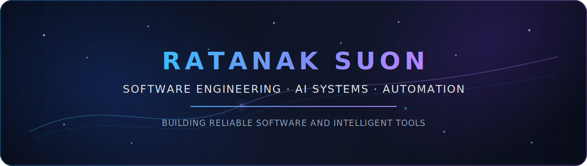

<div align="center">
  
</div>

<br>

<div align="center">

[](https://github.com/NakNakGEO)
[](https://github.com/NakNakGEO?tab=followers)

</div>

## About me

I am a software developer focused on production systems, intelligent automation, and applied AI engineering.

- Building backend services, workflow platforms, and data-intensive applications
- Developing private AI systems that combine LLMs, agents, machine learning, and automation
- Exploring local model infrastructure, knowledge systems, and multi-agent orchestration
- Designing tools that turn complex technical decisions into reliable software workflows

## Core stack

<div align="center">


</div>

## Current engineering focus

<table>
  <tr>
    <td width="50%" valign="top">
      <h3 align="center">Agentic AI Platform</h3>
      <p>
        A private AI engineering environment for coordinating specialized agents, development workflows, research tasks, project memory, and local or cloud model execution.
      </p>
      <p><strong>Focus:</strong> orchestration, tool use, knowledge retrieval, evaluation, observability, and secure automation.</p>
    </td>
    <td width="50%" valign="top">
      <h3 align="center">AI Trading Research System</h3>
      <p>
        A private multi-layer research platform combining market data, technical structure, machine learning, LLM reasoning, signal validation, and risk controls.
      </p>
      <p><strong>Focus:</strong> data quality, regime detection, ensemble decisions, explainability, backtesting, and execution safety.</p>
    </td>
  </tr>
  <tr>
    <td width="50%" valign="top">
      <h3 align="center">Local AI Infrastructure</h3>
      <p>
        A distributed environment for running local models, coding agents, vector search, repository intelligence, and persistent project knowledge across multiple machines.
      </p>
      <p><strong>Focus:</strong> inference routing, model serving, GPU utilization, indexing, privacy, and system reliability.</p>
    </td>
    <td width="50%" valign="top">
      <h3 align="center">Enterprise Automation</h3>
      <p>
        Backend services and workflow solutions for approvals, identity integration, reporting, business rules, and operational process automation.
      </p>
      <p><strong>Focus:</strong> C#, SQL Server, APIs, workflow engines, access control, and maintainable production systems.</p>
    </td>
  </tr>
</table>

> Most active projects are private because they contain proprietary architecture, internal workflows, research logic, or production-related integrations.

## System direction

```text
Market and enterprise data
          ↓
Reliable backend services
          ↓
Machine learning and LLM reasoning
          ↓
Specialized agents and orchestration
          ↓
Observable, secure automation
```

My long-term goal is to build an integrated AI engineering platform that can understand repositories, preserve project knowledge, support software development, coordinate specialized workers, and assist with high-quality technical decisions.

## Engineering principles

- Reliability before complexity
- Evidence before automated decisions
- Clear boundaries between AI reasoning and deterministic control
- Private-by-default infrastructure for sensitive systems
- Measurable performance, traceable actions, and safe failure modes

## GitHub activity

<div align="center">
  
</div>

---

<div align="center">
  <sub>Building serious systems quietly — architecture first, intelligence where it adds real value.</sub>
</div>
